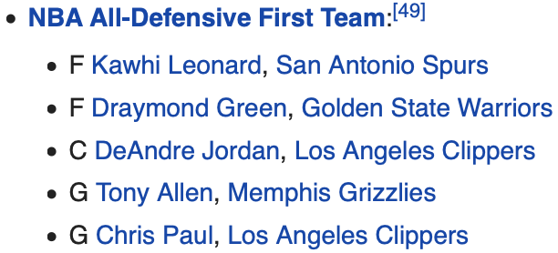

# 目標
> 利用統計數據，分析以下四點：<br>
> 1. 探討主客場優勢是否存在<br>
> 2. 最佳進攻者與最佳防守者<br>
> 3. 兩分球與三分球對勝負的影響<br>
> 4. 投籃命中率高的條件<br>
> 5. 個別進攻者與防守者之間的關係<br>

```{r}
library(plyr)
library(readr)
library(dplyr)
library(jiebaR)
library(tidyr)
library(tidytext)
library(igraph)
library(topicmodels)
library(stringr)
library(ggplot2)
library(jsonlite)
```

> 資料來源：kaggle上的NBA shot logs資料集<br>
> https://www.kaggle.com/dansbecker/nba-shot-logs

# 讀入資料
```{r}
records = read_csv("shot_logs.csv")
records
```

```{r}
# 出手球員的id與name
player_list <- records %>% select(player_name, player_id) %>% unique() %>% rename(name = player_name)

# 統一姓名格式
pro_records <- records %>% 
  separate(CLOSEST_DEFENDER, c("first_name", "last_name"), fill = "warn", sep = ", ") %>% 
  unite("defender_name", last_name, first_name, sep =" ") %>%
  left_join(player_list, by = c("CLOSEST_DEFENDER_PLAYER_ID" = "player_id")) %>% 
  mutate(defender_name = ifelse(!is.na(name), name, tolower(defender_name))) %>% 
  select(-name)

shot_Data = pro_records %>%
  na.omit(shot_Data) %>%
  filter(SHOT_CLOCK!=24 & TOUCH_TIME>=0)
shot_Data$PTS_TYPE = as.factor(shot_Data$PTS_TYPE)
pro_records
```
> 會發現 CLOSEST_DEFENDER 的名字與 player_name 的格式不一樣，因此我們先將格式統一。

# 是否有主客場優勢
```{r}
home_away_WL = shot_Data %>% 
  select(GAME_ID, MATCHUP, LOCATION, W, FINAL_MARGIN) %>%
  unique() %>%
  arrange(GAME_ID) %>% 
  filter(LOCATION == "H") %>%
  mutate(WL = W, A_FINAL_MARGIN = FINAL_MARGIN) %>%
  select(GAME_ID, MATCHUP, WL, A_FINAL_MARGIN)

home_away_WL$MATCHUP = as.character(home_away_WL$MATCHUP)
home_away_WL = separate(home_away_WL, MATCHUP, into = c("date", "gameteam"), sep = " - ")
home_away_WL = separate(home_away_WL, gameteam, into = c("A_team", "H_team"), sep = " @ ")

home_away_WL %>% 
  ggplot(aes(x = WL, fill = WL)) + 
  geom_bar()
```
>有主客場優勢存在

```{r}
home_away_WL %>% 
  group_by(WL) %>% 
  count() %>% 
  ungroup() %>% 
  mutate(total = sum(n)) %>% 
  mutate(percent = n/total)
```
>主場勝率56.1383%
>客場勝率43.8617%

# 上場次數大於100之前10位成功防守率最高球員
```{r}
most_success_Def = shot_Data %>%
    filter(SHOT_RESULT=="missed") %>%
    group_by(defender_name) %>%
    summarise(Success = n()) %>%
    arrange(desc(Success))
most_failure_Def = shot_Data %>%
    filter(SHOT_RESULT=="made") %>%
    group_by(defender_name) %>%
    summarise(Failure = n()) %>% 
    arrange(desc(Failure))
success_percent_Def = full_join(most_success_Def, most_failure_Def, by="defender_name")
success_percent_Def[is.na(success_percent_Def)] <- 1

success_percent_Def = success_percent_Def %>% 
  mutate(Percent = (Success/(Success+Failure))) %>% 
  arrange(desc(Percent))

success_percent_Def %>% 
  filter(Success >= 100 & Failure >= 100) %>% 
  top_n(10)
```

# 防守球員成功防守率密度曲線圖
```{r}
success_percent_Def %>% 
  filter(Success >= 100 & Failure >= 100) %>% 
  ggplot(aes(x = Percent)) + 
  geom_density()
```

# 上場次數大於100之前10位命中率最高的球員
```{r}
most_success_player<- shot_Data %>% 
  filter(SHOT_RESULT=="made") %>%
  group_by(player_name) %>%
  summarise(Success = n()) %>%
  arrange(desc(Success))
most_failure_player<- shot_Data %>% 
  filter(SHOT_RESULT=="missed") %>%
  group_by(player_name) %>%
  summarise(Failure = n()) %>%
  arrange(desc(Failure))
success_percent_player = full_join(most_success_player, most_failure_player, by="player_name")
success_percent_player[is.na(success_percent_player)] <- 1

success_percent_player = success_percent_player %>% 
  mutate(Percent = (Success/(Success+Failure))) %>% 
  arrange(desc(Percent))

success_percent_player %>% 
  filter(Success >= 100 & Failure >= 100) %>% 
  top_n(10)
```


# 進攻球員命中率的密度曲線圖
```{r}
success_percent_player %>% 
  filter(Success >= 100 & Failure >= 100) %>% 
  ggplot(aes(x = Percent)) + 
  geom_density()
```

# 球員命中率與防守成功率散佈圖
```{r}
success_percent_player %>% 
  rename(name = player_name) %>% 
  filter(Success>100 & Failure>100) %>% 
  left_join(success_percent_Def %>% rename(name = defender_name) %>% filter(Success>100 & Failure>100), by = "name") %>% 
  rename(playP = Percent.x, defP = Percent.y) %>% 
  select(name, playP, defP) %>% 
  na.omit() %>% 
  ggplot(aes(x = playP, y = defP, color = abs(defP - playP))) +
  geom_abline(color = "gray40", lty = 2, slope = 0.5457545/0.4525722) +
  geom_vline(xintercept = 0.4525722, color="orange") +
  geom_hline(yintercept = 0.5457545, color="orange") +
  geom_jitter(alpha = 0.3, size = 2.5) +
  geom_text(aes(label = name), check_overlap = TRUE) +
  theme(legend.position="none") +
  labs(x = "FG%", y = "DEF%")
```
> 垂直線代表出手平均命中率，水平線代表防守平均成功率。


# 兩分球、三分球投進/未投進數量比
```{r}
shot_Data %>% 
  group_by(PTS_TYPE, SHOT_RESULT) %>% 
  summarise(total = n()) %>% 
  ggplot(aes(x=PTS_TYPE, y=total, fill=SHOT_RESULT)) +
  geom_bar(stat="identity", position="fill") +
  geom_text(aes(label = total), position = position_fill(0.5)) +
  xlab("分數種類") + 
  ylab("命中率") + 
  ggtitle("兩分球、三分球投進/未投進數量比") + 
  theme(text = element_text(family = "Heiti TC Light"))
```

# 兩分球與三分球的期望值
```{r}
shot_Data %>% 
  group_by(PTS_TYPE) %>%
  summarise(PTS_TYPE_EXP = mean(PTS))
```

# 投三分球的數量多寡對於比賽勝負的影響
```{r}
two_three_points = shot_Data %>% 
  group_by(GAME_ID, LOCATION, PTS_TYPE, W) %>%
  summarise(TOTAL_SHOT_NUM = n()) %>%
  spread(PTS_TYPE, TOTAL_SHOT_NUM) %>% 
  setNames(c("GAME_ID", "LOCATION", "W", "PTS_TYPE_2", "PTS_TYPE_3")) %>% 
  mutate(total_shot = PTS_TYPE_2 + PTS_TYPE_3, shot3_prop = PTS_TYPE_3 / total_shot) %>% 
  na.omit()

two_three_points %>% 
  ggplot(aes(x=shot3_prop, fill=W, alpha = 0.05)) + 
  geom_density()
```
> 三分球投得多的勝率高。

# 觀看三分球比率前一百的比賽球隊，勝率確實較高
```{r}
two_three_points %>%
  arrange(desc(shot3_prop)) %>% 
  head(100) %>% 
  group_by(W) %>% 
  count()
```

# 防守距離與命中率關係
```{r}
shot_Data %>%
  mutate(def_distance = CLOSE_DEF_DIST + 1) %>% # 
  group_by(def_distance, PTS_TYPE) %>%
  summarise(Percent = mean(FGM)) %>%
  ggplot(aes(x = log(def_distance, base = 2), y = Percent)) + 
  geom_smooth(se = FALSE, method = "loess", formula = 'y ~ x') + 
  facet_grid(. ~ PTS_TYPE) + 
  theme_light()
```
> 兩分球在八英尺後，與防守距離有比較大的關係。<br>
> 三分球則與防守距離有明顯關係，整體命中率還是低於兩分球。

# 運球次數與命中率率關係
```{r}
shot_Data %>%
  group_by(DRIBBLES) %>%
  summarise(Percent = mean(FGM)) %>%
  ggplot(aes(x = DRIBBLES, y = Percent)) + 
  geom_smooth(se = FALSE, method = "loess", formula = 'y ~ x') + 
  theme_light()
```
> 運球次數越多，命中率越低。

# 投球距離與進球數的趨勢圖
```{r}
shot_Data %>% 
  ggplot(aes(x=SHOT_DIST, color=SHOT_RESULT, group=SHOT_RESULT)) + 
  geom_density() +
  xlab("Shot Distance") + 
  ylab("") +
  theme_light()+ 
  geom_vline(xintercept = 22, color="blue") +
  geom_text(aes(x=22, label="3-point line", y=0.08), colour="blue", angle=90, vjust = -1)
```
> 距離籃框越近，命中率越高，另外也可看出，球員出手的兩個高點，分別為禁區與三分線外一步。

# 挑出有該年度冠軍金州勇士的球員出手紀錄
> 該年度總冠軍隊伍為金州勇士，我們將其球員的出手紀錄與對到的防守球員挑出來做分析。

```{r}
warriors <- pro_records %>% 
  filter(str_detect(MATCHUP, "GSW ")) %>% 
  add_count(defender_name, player_name, name = "d_FG") %>% 
  group_by(defender_name, player_name, d_FG) %>% 
  summarise(d_FGM = sum(FGM)) %>% 
  filter(d_FG >= 10) %>% 
  ungroup() %>% 
  mutate(d_FGP = d_FGM/d_FG)
warriors
```

```{r}
# 建立網路關係
was_Network <- graph_from_data_frame(d=warriors, directed=T)
# 畫出網路圖
# 線的粗細代表防守到的次數多寡
# 綠線表示防守效益優於平均
# 紅線表示防守效益差於平均
set.seed(231)
E(was_Network)$color <- ifelse(E(was_Network)$d_FGP < mean(E(was_Network)$d_FGP) , "lightgreen", "palevioletred")
E(was_Network)$width <- (E(was_Network)$d_FG/10)^1.5
plot(was_Network, vertex.size=2, edge.arrow.size=0.1, vertex.label.cex=0.7)
```
> 勇士教練Kerr在設計戰術時，球員可以多挑防守效益不佳的球員做單打，若對上防守效益好的球員則可透過傳導化解。

## 篩選出總出手次數大於一定次數的紀錄
> 選出所有球員中總出手次數大於940的球員，相對其他球員可表示他們在場上時間更多，為隊上的主力輸出。

```{r}
# 篩選出總出手次數大於940的紀錄
# 挑出相遇次數大於 15 次的紀錄
count_records <- pro_records %>% 
  add_count(player_name, name = "p_count") %>% 
  filter(p_count >= 940) %>% 
  add_count(defender_name, player_name, name = "d_FG") %>% 
  group_by(defender_name, player_name, d_FG) %>% 
  summarise(d_FGM = sum(FGM)) %>% 
  filter(d_FG >= 15) %>% 
  ungroup() %>% 
  mutate(d_FGP = d_FGM/d_FG)
count_records
```

```{r}
# 建立網路關係
count_Network <- graph_from_data_frame(d=count_records, directed=T)
# 畫出網路圖
# 線的粗細代表防守到的次數多寡
# 綠線表示防守效益優於平均
# 紅線表示防守效益差於平均
set.seed(1213)
E(count_Network)$color <- ifelse(E(count_Network)$d_FGP < mean(E(count_Network)$d_FGP) , "lightgreen", "palevioletred")
E(count_Network)$width <- E(count_Network)$d_FG/10
plot(count_Network, vertex.size=2, edge.arrow.size=0.2, vertex.label.cex=0.7)
```


> 從圖中可以看出，Westbrook在進攻時，較容易被防守者影響而投不進。<br>
> Curry 與 Harden 的表現明顯較圖中的其他人好。<br>
> 但有可能因為進攻者本身命中率的高低，而使得其他球員的防守差距不明顯，所以...

# 防守效益比較
> 透過先計算出一名出手球員的總命中率，與個別球員防守時的命中率差值，<br>
> 來單獨看每位防守球員在對上哪位出手球員時，有較大的防守效益。

```{r}
# 出手球員總命中率
field_goal_per <- pro_records %>% 
  group_by(player_name) %>% 
  mutate(total_FGM = sum(FGM), total_FG = n()) %>% 
  mutate(total_FGP = total_FGM/total_FG) %>% 
  ungroup()
field_goal_per %>% select(defender_name, player_name, FGM, total_FGM, total_FG, total_FGP)
```

```{r}
# 出手球員與個別防守球員相對時之命中率
pair_def_records <- field_goal_per %>% 
  select(defender_name, player_name, FGM, total_FGP) %>% 
  group_by(defender_name, player_name, total_FGP) %>% 
  summarise(def_FGM = sum(FGM), def_FG = n()) %>% 
  mutate(def_FGP = def_FGM/def_FG) %>% 
  ungroup()
pair_def_records
```

```{r}
# 個別組合間的防守效益差距
# 挑出相遇次數大於 8 次的紀錄
# 挑出差異大於 30% 的組合
s_pair_def_records <- pair_def_records %>% 
  filter(def_FG >= 8) %>% 
  mutate(dif_FGP = def_FGP - total_FGP) %>% 
  filter(abs(dif_FGP) >= 0.3) %>% 
  select(defender_name, player_name, dif_FGP)
s_pair_def_records
```

```{r}
# 建立網路關係
s_pair_def_Network <- graph_from_data_frame(d=s_pair_def_records, directed=T)
# 畫出網路圖
# 防守影響較大的關係：綠色
# 防守影響較小的關係：紅色
set.seed(1234)
E(s_pair_def_Network)$color <- ifelse(E(s_pair_def_Network)$dif_FGP < 0 , "lightgreen", "palevioletred")
plot(s_pair_def_Network, vertex.size=2, edge.arrow.size=0.3, vertex.label.cex=0.7)
```


# 年度最佳防守陣容
> NBA每年都會由各隊總教練選出防守第一隊與第二隊，從球場上的各個位置選最適合的人選。<br>
> 這裡我們找出2014-15賽季，防守第一隊與第二隊的名單，<br>
> 透過在名單上各球員的防守下，出手球員命中率的差別來驗證這份名單。

## 年度最佳防守陣容第一隊


```{r}
# 個別組合間的防守效益差距
# 挑出相遇次數的大於 3 次的紀錄
# 挑出差異大於 30% 的組合
first_team_records <- pair_def_records %>% 
  filter(defender_name == "kawhi leonard" | 
         defender_name == "draymond green" |
         defender_name == "deandre jordan" |
         defender_name == "tony allen" |
         defender_name == "chris paul") %>% 
  filter(def_FG >= 3) %>% 
  mutate(dif_FGP = def_FGP - total_FGP) %>% 
  filter(abs(dif_FGP) >= 0.3) %>% 
  select(defender_name, player_name, dif_FGP)
first_team_records
```

```{r}
# 建立網路關係
first_team_Network <- graph_from_data_frame(d=first_team_records, directed=T)
# 畫出網路圖
# 防守影響較大的關係：綠色
# 防守影響較小的關係：紅色
set.seed(2019)
E(first_team_Network)$color <- ifelse(E(first_team_Network)$dif_FGP < 0 , "lightgreen", "palevioletred")
plot(first_team_Network, vertex.size=2, edge.arrow.size=0.3, vertex.label.cex=0.7)
```


> 由圖中可以看出，Tony Allen的防守效益特別優異，其他四位也大多是防守成功率高的。

## 年度最佳防守陣容第二隊


```{r}
# 個別組合間的防守效益差距
# 挑出相遇次數的大於 3 次的紀錄
# 挑出差異大於 30% 的組合
second_team_records <- pair_def_records %>% 
  filter(defender_name == "anthony davis" | 
         defender_name == "tim duncan" |
         defender_name == "andrew bogut" |
         defender_name == "jimmy butler" |
         defender_name == "john wall") %>% 
  filter(def_FG >= 3) %>% 
  mutate(dif_FGP = def_FGP - total_FGP) %>% 
  filter(abs(dif_FGP) >= 0.3) %>% 
  select(defender_name, player_name, dif_FGP)
second_team_records
```

```{r}
# 建立網路關係
second_team_Network <- graph_from_data_frame(d=second_team_records, directed=T)
# 畫出網路圖
# 防守影響較大的關係：綠色
# 防守影響較小的關係：紅色
set.seed(222)
E(second_team_Network)$color <- ifelse(E(second_team_Network)$dif_FGP < 0 , "lightgreen", "palevioletred")
plot(second_team_Network, vertex.size=2, edge.arrow.size=0.3, vertex.label.cex=0.7)
```


> 由圖中可以看出，多數球員的防守效益都很不錯，其中比較特別的是 Tim Duncan，綠線與紅線都很多，可見其防守表現起伏較大。

## 去除Wide Open狀態下的資料
> 來源資料中是每一筆的出手紀錄，故其中的防守球員只是距離出手球員最近的球員，<br>
> 但球場上可能透過卡位、空切、傳球等手段來跑出空檔，此時出手球員會與防守球員拉開一段距離，<br>
> 此時防守球員是誰的意義便不會那麼大，因此我們透過數據中的最近防守球員距離為依據，<br>
> 將距離超過 4.92feet(=1.5公尺) 的紀錄去除，再看剛剛的年度最佳防守陣容第一隊和第二隊的紀錄。

```{r}
# 挑出與防守者距離小於 4.92feet 的紀錄
no_wide_records <- pro_records %>% 
  filter(CLOSE_DEF_DIST <= 4.92)
no_wide_records
```

```{r}
# 出手球員總命中率
n_field_goal_per <- no_wide_records %>% 
  group_by(player_name) %>% 
  mutate(total_FGM = sum(FGM), total_FG = n()) %>% 
  mutate(total_FGP = total_FGM/total_FG) %>% 
  ungroup()

# 出手球員與個別防守球員相對時之命中率
n_pair_def_records <- n_field_goal_per %>% 
  select(defender_name, player_name, FGM, total_FGP) %>% 
  group_by(defender_name, player_name, total_FGP) %>% 
  summarise(def_FGM = sum(FGM), def_FG = n()) %>% 
  mutate(def_FGP = def_FGM/def_FG) %>% 
  ungroup()
n_pair_def_records
```

## 年度最佳防守陣容第一隊(剔除wide open)
```{r}
# 個別組合間的防守效益差距
# 挑出相遇次數的大於 3 次的紀錄
# 挑出差異大於 25% 的組合
n_first_team_records <- n_pair_def_records %>% 
  filter(defender_name == "kawhi leonard" | 
         defender_name == "draymond green" |
         defender_name == "deandre jordan" |
         defender_name == "tony allen" |
         defender_name == "chris paul") %>% 
  filter(def_FG >= 3) %>% 
  mutate(dif_FGP = def_FGP - total_FGP) %>% 
  filter(abs(dif_FGP) >= 0.3) %>% 
  select(defender_name, player_name, dif_FGP)
n_first_team_records
```

```{r}
# 建立網路關係
n_first_team_Network <- graph_from_data_frame(d=n_first_team_records, directed=T)
# 畫出網路圖
# 防守影響較大的關係：綠色
# 防守影響較小的關係：紅色
set.seed(31)
E(n_first_team_Network)$color <- ifelse(E(n_first_team_Network)$dif_FGP < 0 , "lightgreen", "palevioletred")
plot(n_first_team_Network, vertex.size=2, edge.arrow.size=0.3, vertex.label.cex=0.7)
```


> Deandre Jordan很明顯地變差，我們研究看看他的防守紀錄。

## Deandre Jordan
```{r}
pro_records %>% 
  filter(defender_name == "deandre jordan") %>%
  filter(CLOSE_DEF_DIST <= 25) %>% 
  mutate(CLOSE_DEF_DIST = CLOSE_DEF_DIST %/% 0.01 / 100) %>% 
  group_by(defender_name, CLOSE_DEF_DIST, SHOT_RESULT) %>% 
  summarise(count = n()) %>% 
  ungroup() %>% 
  group_by(defender_name, CLOSE_DEF_DIST) %>% 
  mutate(total = sum(count)) %>% 
  filter(SHOT_RESULT == "missed") %>% 
  mutate(per = count/total) %>% 
  ggplot(aes(x = CLOSE_DEF_DIST, y = per)) +
  geom_point(size = 1) +
  geom_smooth(method = "loess", formula = "y ~ x", se = FALSE) +
  geom_vline(xintercept = 4.92, color = "blue") + 
  labs(x = "與攻擊者的距離", y = "防守成功率") +
  theme(text = element_text(family = "Heiti TC Light")) +
  ylim(0, 1)
```
> 可以看出在 4.92feet 以內的防守成功率，明顯比大於 4.92feet 的成功率低了很多。<br>
> 也把 Tony Allen 的數據拿出來看，可以發現在 4.92feet 以內的防守成功率明顯優於 Deandre Jordan。

```{r}
pro_records %>% 
  filter(defender_name == "tony allen") %>%
  filter(CLOSE_DEF_DIST <= 25) %>% 
  mutate(CLOSE_DEF_DIST = CLOSE_DEF_DIST %/% 0.01 / 100) %>% 
  group_by(defender_name, CLOSE_DEF_DIST, SHOT_RESULT) %>% 
  summarise(count = n()) %>% 
  ungroup() %>% 
  group_by(defender_name, CLOSE_DEF_DIST) %>% 
  mutate(total = sum(count)) %>% 
  filter(SHOT_RESULT == "missed") %>% 
  mutate(per = count/total) %>% 
  ggplot(aes(x = CLOSE_DEF_DIST, y = per)) +
  geom_point(size = 1) +
  geom_smooth(method = "loess", formula = "y ~ x", se = FALSE) +
  geom_vline(xintercept = 4.92, color = "blue") + 
  labs(x = "與攻擊者的距離", y = "防守成功率") +
  theme(text = element_text(family = "Heiti TC Light")) +
  ylim(0, 1)
```

## 年度最佳防守陣容第二隊(剔除wide open)
```{r}
# 個別組合間的防守效益差距
# 挑出相遇次數的大於 3 次的紀錄
# 挑出差異大於 30% 的組合
n_second_team_records <- n_pair_def_records %>% 
  filter(defender_name == "anthony davis" | 
         defender_name == "tim duncan" |
         defender_name == "andrew bogut" |
         defender_name == "jimmy butler" |
         defender_name == "john wall") %>% 
  filter(def_FG >= 3) %>% 
  mutate(dif_FGP = def_FGP - total_FGP) %>% 
  filter(abs(dif_FGP) >= 0.3) %>% 
  select(defender_name, player_name, dif_FGP)
n_second_team_records
```

```{r}
# 建立網路關係
n_second_team_Network <- graph_from_data_frame(d=n_second_team_records, directed=T)
# 畫出網路圖
# 防守影響較大的關係：綠色
# 防守影響較小的關係：紅色
set.seed(2019)
E(n_second_team_Network)$color <- ifelse(E(n_second_team_Network)$dif_FGP < 0 , "lightgreen", "palevioletred")
plot(n_second_team_Network, vertex.size=2, edge.arrow.size=0.3, vertex.label.cex=0.7)
```


> 與沒有去除 wide open 的資料差距不大。 

# 結論
> 1. 主客場優勢確實存在。<br>
> 2. 三分球投得越多，勝率越高。<br>
> 3. 進攻者離籃框越近，命中率越高。<br>
> 4. 運球次數越少，命中率越高。<br>
> 5. 可透過網路圖看出特定防守組合之間的防守效益。<br>
> 6. 年度最佳防守陣容中，可看出部分球員實際防守影響很顯著，但也有些沒有很突出的表現。<br>

> 分析這個現象產生的原因，我們認為是因為在籃球的「防守」中，並不單單只是要防守進攻者出手，還有進攻籃板、防守籃板、抄截、防守意識等等，所以若單就出手數據評斷可能不夠完整，所以我們不能以此就否定這份名單的純度，但可以懷疑一些在防守進攻者出手上效益不好的球員。


